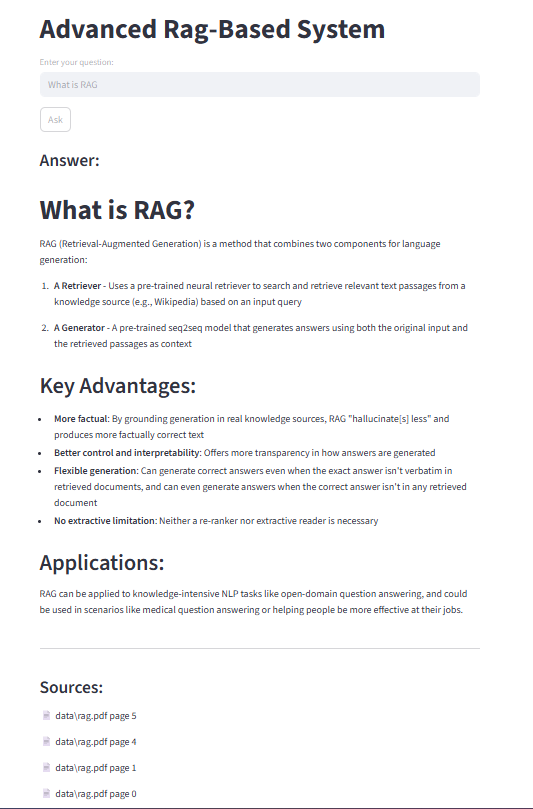

# Advanced RAG Document Q&A System

A production-style Retrieval Augmented Generation (RAG) pipeline that lets users ask questions about a collection of PDF documents using natural language.

## Features

- Multi-query retrieval — Claude generates 3 alternative phrasings to improve recall
- Cross-encoder reranking — scores retrieved chunks for precise relevance
- Contextual compression — filters noise before sending to the model
- Source citations — every answer includes filename and page number
- Streamlit UI — clean web interface for interaction

## Tech Stack

- LangChain — orchestration
- ChromaDB — vector storage
- HuggingFace `all-MiniLM-L6-v2` — embeddings
- `cross-encoder/ms-marco-MiniLM-L-6-v2` — reranking
- Claude Haiku (Anthropic) — generation
- Streamlit — UI

## Project Structure
```
Advanced-RAG-Document-QA/
├── data/              # Place your PDF files here
├── ingestion.py       # One-time script to build vector store
├── retriever.py       # Multi-query + reranking + compression
├── chain.py           # Claude generation with citations
├── app.py             # Streamlit UI
├── main.py            # Terminal UI alternative
└── requirements.txt
```

## Setup

1. Clone the repo
```
git clone https://github.com/MujahidMalik7/Advanced-RAG-Document-QA.git
cd Advanced-RAG-Document-QA
```

2. Install dependencies
```
pip install -r requirements.txt
```

3. Create `.env` file
```
ANTHROPIC_API_KEY=your_key_here
```

4. Add PDF files to `/data` folder

5. Run ingestion (once only)
```
python ingestion.py
```

6. Launch the app
```
streamlit run app.py
```

## How It Works
```
User question
    ↓
Claude generates 3 alternative queries
    ↓
ChromaDB searched with all 4 queries
    ↓
Cross-encoder reranks, keeps top 5 chunks
    ↓
Claude generates answer with source citations
```

## Demo
```


```
